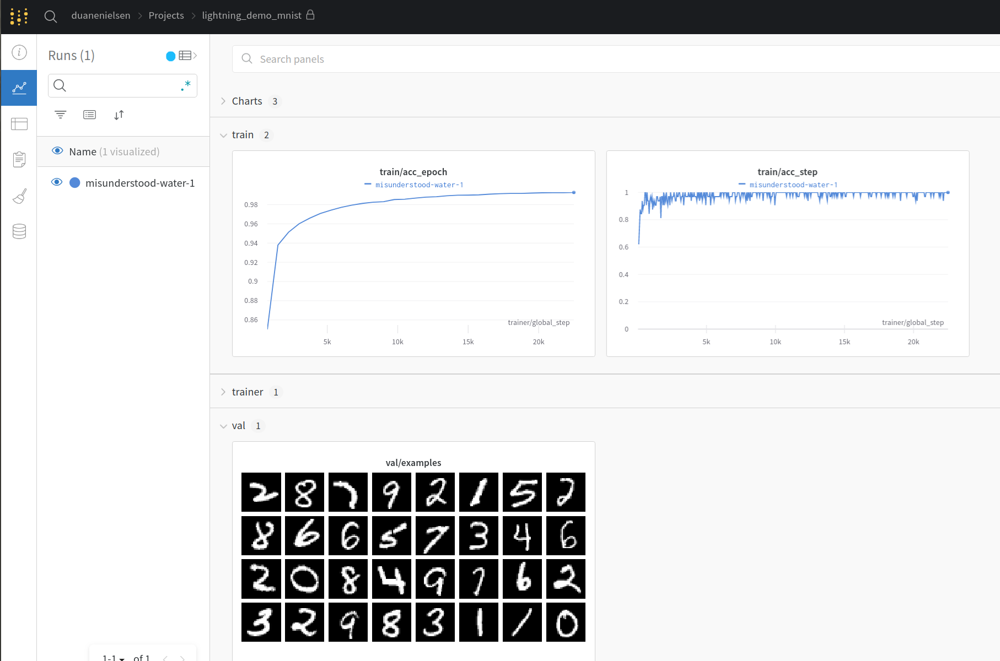

# Pytorch Lightning Demo

Minimalist example demonstrating classification of MNIST digits.

Check it out at https://wandb.ai/duanenielsen/lightning_demo_mnist

* Training metrics and images on Weights and Biases  
* MNIST LightningDataModule
* Multi GPU training

Note: debugging only works if num_workers = 0

